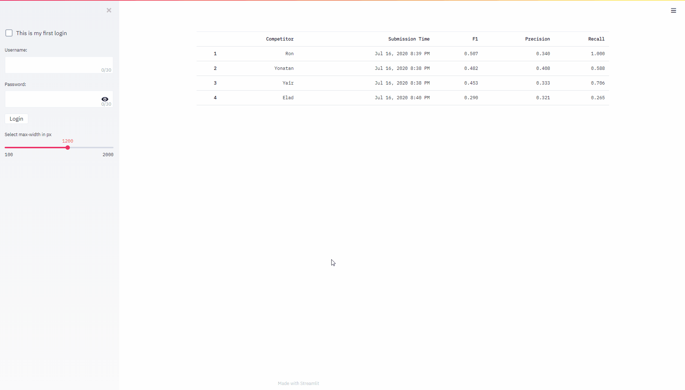

# streamlit-leaderboard
A general purpose leaderboard for small ML competitions using Streamlit.

## Demo



## Installation
This repository requires Python 3.6 or higher.

Run the following commands to clone the repository and install streamlit-leaderboard:
```
git clone https://github.com/yairf11/streamlit-leaderboard.git
cd streamlit-leaderboard; pip install -r requirements.txt
```

## Usage
To run the leaderboard, just run the following command:
```
streamlit run src/app.py
```

## Configure your leaderboard
You can easily configure the leaderboard for your purposes. 
In the file [config.py](src/config.py), 
you can edit the following variables which control the app's most basic behavior:

`EVALUATOR_CLASS`: A subclass of the [Evaluator](src/evaluation/evaluator.py) class
 used for the evaluation of the users' submissions. 
 This is the most important configuration, 
 and you must implement your own evaluator class. 
 See [this example implementation](src/examples/f1_precision_recall_example.py)
  for detailed information.

`ALLOWED_SUBMISSION_FILE_EXTENSION`: The extension type required for a 
 submission file (e.g. `".json"`). If `None`, any extension is allowed.

`SUBMISSIONS_DIR`: A [pathlib.Path](https://docs.python.org/3/library/pathlib.html) object 
 holding the path to the directory in which the users' submissions will be saved.

`PASSWORDS_FILE`: A [pathlib.Path](https://docs.python.org/3/library/pathlib.html) object 
 holding the name of the encrypted passwords file

`ARGON2_KWARGS`: A dictionary holding keyword arguments for the 
 [argon2 password hasher](https://argon2-cffi.readthedocs.io/en/stable/api.html#argon2.PasswordHasher).

`MAX_NUM_USERS`: The maximum number of users allowed in the system. If `None`, no limitation is enforced.


